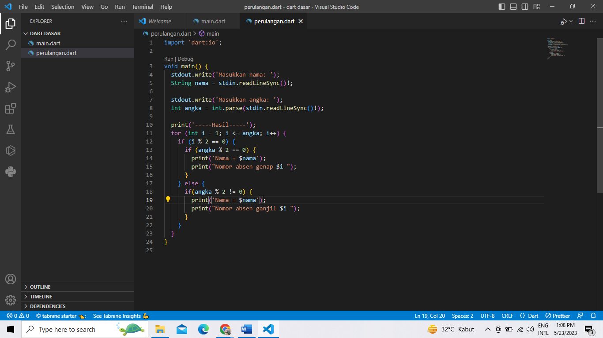

# dart_dasar

### Penjelasan tentang Code dan hasil output:
•	Program mencetak nama diikuti dengan bilangan ganjil atau genap tergantung pada jenisnya.
  - **Gambar**   

•	Output ditampilkan secara berurutan sesuai nama dan angka yang dimasukkan :
A.)Output hanya mencetak bilangan ganjil jika angka yang dimasukkan juga ganjil dan Output dipisahkan dengan baris kosong untuk memudahkan membaca :
  - **Gambar**   

B.)Hanya mencetak bilangan genap jika angka yang dimasukkan juga genap dan Output dipisahkan dengan baris kosong untuk memudahkan membaca :
  - **Gambar**   

# TERIMA KASIH
